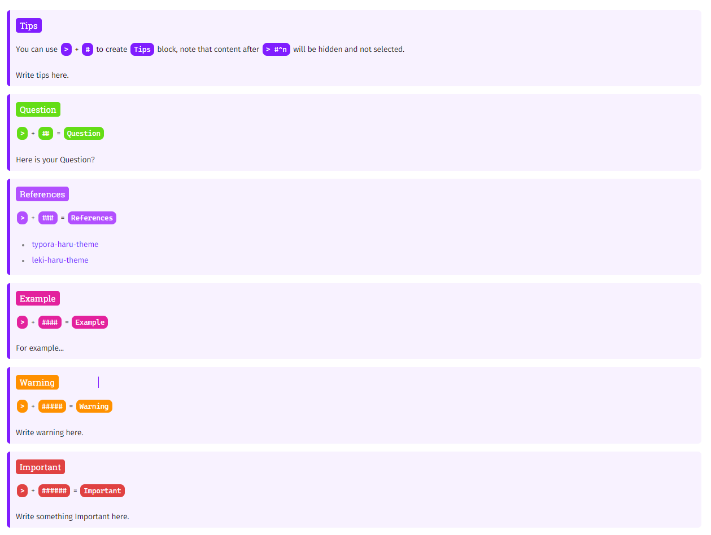
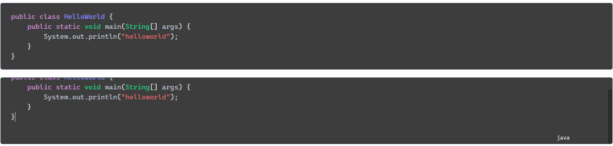

# Description

fork from [@haru](https://github.com/LSTM-Kirigaya/typora-haru-theme)，mainly change css for `h` 、 `blockquote` and `codeblock`.

`codeblock` is inspired by [@typora-night-theme](https://github.com/typora/typora-default-themes/tree/master/themes/night).

# Blockquote

| trigger        | result     |
| -------------- | ---------- |
| `>` + `#`      | Tips       |
| `>` + `##`     | Question   |
| `>` + `###`    | References |
| `>` + `####`   | Example    |
| `>` + `#####`  | Warning    |
| `>` + `######` | Important  |

# Codeblock

scroll down to switch languages.

# More

[for more detail](haru.md)
